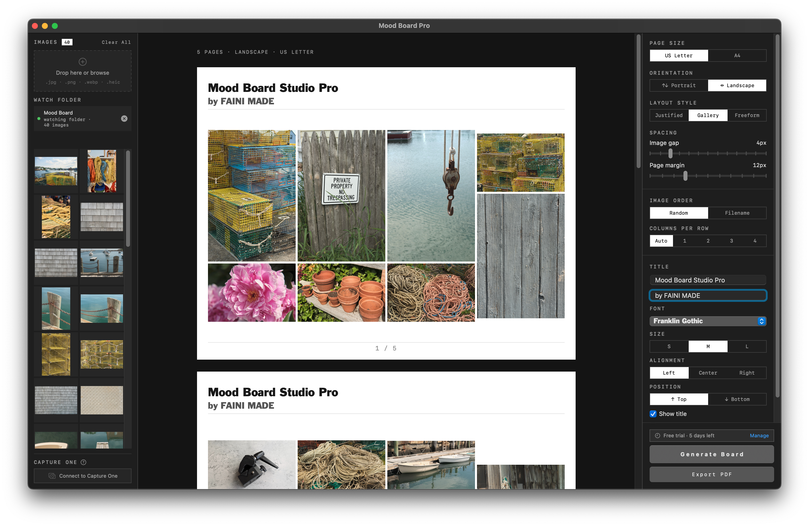

<p align="center">
  
</p>

<h1 align="center">Mood Board Studio Pro</h1>

A native macOS app for laying photos out onto clean, print-ready pages and
exporting them as a PDF. Built with SwiftUI. Photographers who shoot in
**Capture One** can pull an album in directly, with every adjustment, crop and
colour edit already applied.



---

## Features

- **Three-pane workspace** — image tray (left), board canvas (centre), layout
  tools (right).
- **Three layout modes**
  - **Justified** — automatically packs every photo into organic rows across as
    many pages as needed.
  - **Gallery** — masonry-style equal-width columns with natural aspect ratios.
  - **Freeform** — a blank page you drag photos onto, move, and corner-resize
    (proportional, no distortion). On release each photo snaps to keep even
    spacing from its neighbours; drag past a page edge to move it to the
    previous/next page. Right-click a photo for **Scale to Fit Page** — the
    quick way to a one-image-per-page look.
- **Page sizes** — US Letter, A4, or 16:9 widescreen, portrait or landscape.
- **Slideshow** — present the board full screen with **⌥F**; arrow keys move
  between pages, **Esc** exits.
- **Capture One integration** — watch an album and ingest full-quality renders
  as you add photos (see below).
- **PDF export** — every page to a single PDF, with configurable resolution and
  JPEG quality.
- **Titles, page numbers, spacing and margins** — all adjustable from the tools
  pane.
- **5-day free trial**, then a one-time license (sold via Lemon Squeezy) unlocks
  the app for the lifetime of the current major version (see **Licensing**).

## Requirements

- macOS **15.0** or later (Apple silicon and Intel).
- Capture One **16.x** (optional — only for the Capture One integration).

## Download & install

1. **Download** the latest `.zip` from the
   [**Releases**](../../releases/latest) page.
2. **Unzip it** (double-click) and drag **Mood Board Studio Pro.app** into
   your **Applications** folder.
3. **Open it.** The app is signed and notarized by Apple, so the first launch
   just asks you to confirm you downloaded it from the internet — click
   **Open**.

Your **5-day free trial** starts on first launch — everything is unlocked, no
key needed. When you're ready, **buy a license at
[software.fainimade.com](https://software.fainimade.com/)** and paste the key
into **Settings › License › Activate** (see **Licensing** below).

To update later, use **Settings › About › Check for Updates**, or grab the
newest release from the same page and replace the app in Applications.

## Permissions macOS will ask for

Everything runs locally on your Mac — the only network use is license
activation and the update check. Depending on which features you use, macOS
may show these one-time permission prompts:

- **Automation › Capture One** — the first time you connect to Capture One,
  macOS asks to let Mood Board Studio Pro control it. This is how the app asks
  Capture One to render your photos; click **Allow**. Change it later in
  **System Settings › Privacy & Security › Automation**.
- **Folder access** — if you watch a folder that lives in Desktop, Documents,
  or Downloads, macOS asks once before the app may read files there. Change it
  later in **System Settings › Privacy & Security › Files & Folders**.

Photos you drag in directly never trigger a prompt.

## Using the app

1. **Add photos** — drag image files onto the tray, or click it to browse.
   JPEG, PNG, HEIC and WebP are supported.
2. **Choose a layout** — Fill or Freeform, from the tools pane.
3. **Arrange** — in Freeform, drag to move and corner-drag to resize.
4. **Present** — **View › Slideshow** (**⌥F**) shows the board full screen;
   **← →** change pages, **Esc** exits.
5. **Export** — *Export PDF* renders every page to one file.

Press **Delete** / **Backspace** to remove the selected photo (in the tray, a
slot, or a freeform placement) — unless a text field is focused.

## How the Capture One integration works

1. You connect to Capture One and pick a collection (album, favourite, smart
   album…), then click **Start Watching**.
2. The app creates its own dedicated Capture One **recipe** named
   "Mood Board Studio Pro" (your own recipes and output settings are never
   touched) and points it at a private **hot folder**.
3. As Capture One renders each variant through that recipe, a JPEG lands in the
   hot folder. The app polls the folder and adds each new render to the tray
   automatically.
4. New photos added to the album in Capture One are picked up while watching is
   on.

The first time you use it, macOS asks permission for Mood Board Studio Pro to control
Capture One — this is expected; allow it (or later, in **System Settings ›
Privacy & Security › Automation**).

The recipe uses Capture One's **JPEG QuickProof** format — a fast proof
rendered from the preview, with your adjustments applied. There are no size or
quality settings to tune: QuickProof trades archival fidelity for speed, which
is exactly what board layout needs.

### Render cache

The rendered copies live in:

```
~/Library/Application Support/Mood Board Pro/C1Render/<collection>/
```

These files are the live pixel source for the canvas preview *and* the PDF
export, so they persist while photos are on a board. Over time they accumulate.
Clear them anytime from **Settings › Capture One › Render Cache** — photos
currently on a board are always kept.

## Settings (⌘,)

- **Export** — PDF image resolution and JPEG quality, plus an optional
  high-resolution on-screen preview mode for 4K/5K displays.
- **Capture One**
  - *Render Format* — fixed at JPEG QuickProof (nothing to configure).
  - *Render Cache* — on-disk size and a one-click clear.
  - *Advanced — recipe script* — for those who know AppleScript: override the
    recipe script that drives Capture One. Placeholders `{{RECIPE_NAME}}` and
    `{{HOT_FOLDER}}` are filled in automatically. **Reset to Default** restores
    the shipped script if a custom one stops renders from arriving.
- **License** — trial status, license-key activation, and deactivation.
- **Guide** — a plain-language overview of every feature.
- **About** — app icon, version, a *Check for Updates* button, and credits.

## Licensing

Mood Board Studio Pro is **try-before-you-buy**:

- **Free trial** — a fresh install runs for **5 days** with everything unlocked.
- **After the trial** — generating and exporting boards is **locked** until a
  license is activated. Photos already on a board stay visible; you just can't
  build new boards or export a PDF. A banner above the *Generate* / *Export*
  buttons counts down the trial and links to activation.
- **Activation** — buy a key at
  [**software.fainimade.com**](https://software.fainimade.com/) (checkout is
  powered by **Lemon Squeezy**, which generates the keys), then paste it into
  **Settings › License › Activate**. Each key allows a limited number of
  machine activations; use **Deactivate on This Mac** to free a seat before
  moving to another computer.
- **Offline** — once activated, the license keeps working without an internet
  connection. The app re-checks with the licensing server on launch and only
  ever revokes a license if the server explicitly reports it as refunded,
  expired, or disabled — never on a failed network request.

### One license per major version

A license unlocks **one major version** — a **1.x** key works for every 1.x
update, forever. When a new **major** version (**2.0**) ships, it requires a new
license — but upgrading is always your choice: your current version never
stops working.


## Notes

- Closing the main window quits the app (and closes an open Settings window).
- A one-time welcome appears on first launch, pointing at the in-app Guide.
